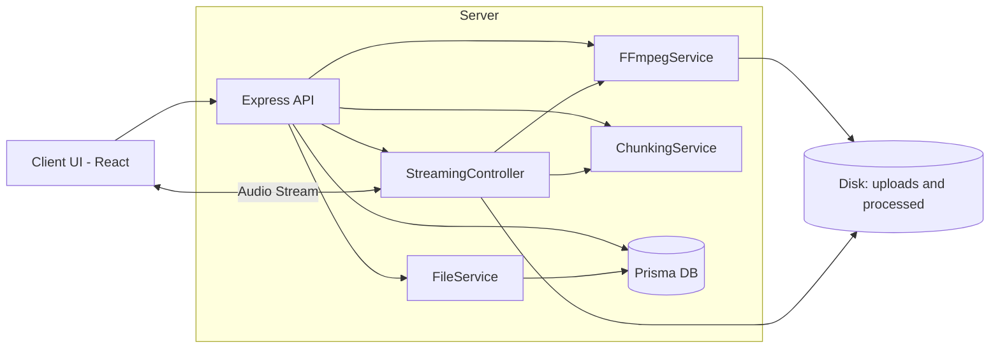
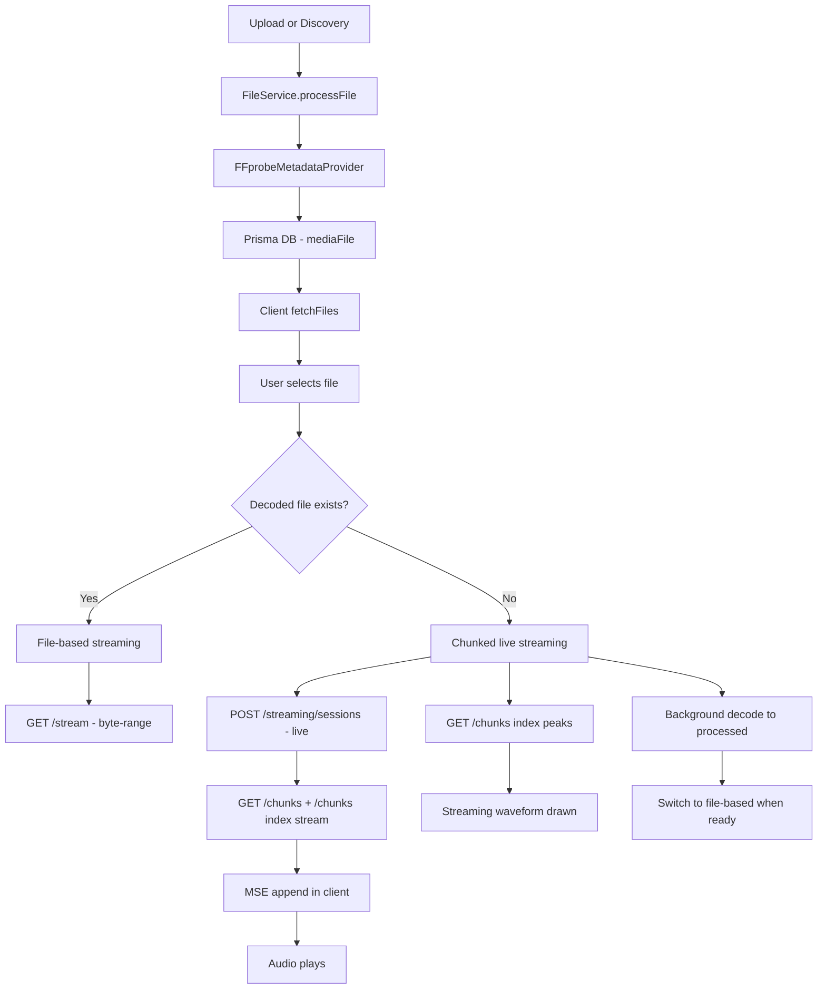
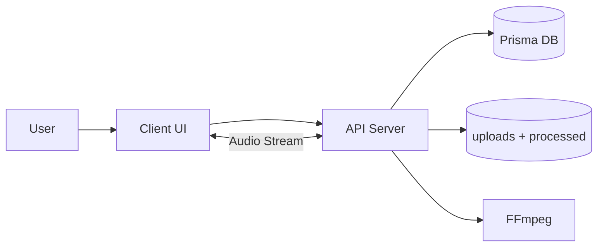
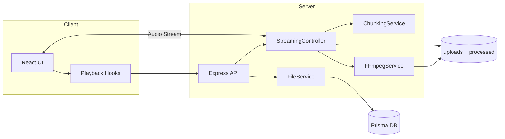
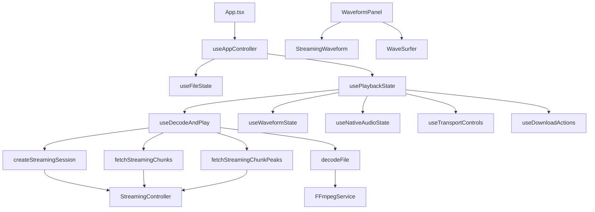

# Architecture and Data Flow

This document describes the end-to-end architecture, data flow, and component roles for the current I-Player implementation (UI, server, database).

## 1) Architecture Overview

## 2) Data Flow (End-to-End)

## 3) Component Roles (0/1/2)

### Component Diagrams

**Level 0 (System Context)**

**Level 1 (Container Diagram)**

**Level 2 (Component Diagram)**

### 0) UI Layer (Client)
- **Responsibilities**:
  - List files, decode, stream, playback controls, waveform rendering.
- **Key files**:
  - `client/src/App.tsx` - UI wiring and playback control routing
  - `client/src/hooks/useAppController.ts` - orchestrates state
  - `client/src/hooks/usePlaybackState.ts` - playback modes + media state
  - `client/src/hooks/playback/useDecodeAndPlay.ts` - decode + streaming mode switch
  - `client/src/components/Player/WaveformPanel.tsx` - waveform layout
  - `client/src/components/Player/StreamingWaveform.tsx` - live waveform drawing

### 1) Service Layer (Server/API)
- **Responsibilities**:
  - File discovery, decoding, streaming, chunking, waveform peaks.
- **Key files**:
  - `server/src/controllers/StreamingController.ts` - stream endpoints
  - `server/src/services/file/FileService.ts` - discovery + metadata
  - `server/src/services/chunking/ChunkingService.ts` - chunk metadata
  - `server/src/services/ffmpeg/FFmpegService.ts` - decode/transcode

### 2) Persistence Layer (DB + Disk)
- **Prisma DB**:
  - Stores metadata: duration, codec, bitrate, decodedPath
- **Disk**:
  - Raw files: `server/uploads`
  - Decoded files: `server/processed`

## 4) UI <-> Server <-> DB Interaction

**UI -> Server**
- Requests file list, decoding, and streaming sessions.
- Fetches chunk list and chunk peaks for live waveform.

**Server -> DB**
- FileService saves metadata into Prisma on discovery.
- StreamingController updates decodedPath when decode finishes.

**Server -> Disk**
- Writes decoded files to `processed`.
- Streams from `uploads` or `processed`.

## 5) End-to-End Playback Modes

**File-based mode (default)**
- Uses decoded file.
- HTTP byte-range streaming.
- WaveSurfer renders waveform from file URL.

**Chunked live mode (play-now)**
- Uses original raw file.
- Server streams 10s chunks via ffmpeg.
- Client appends chunks using MSE.
- Server-generated peaks provide waveform during live playback.
- Switches to file-based after decode finishes.

## 6) Key Endpoints

- `GET /api/files`
- `POST /api/files/upload`
- `POST /api/ffmpeg/decode`
- `POST /api/streaming/sessions`
- `GET /api/streaming/sessions/:id/stream`
- `GET /api/streaming/sessions/:id/chunks`
- `GET /api/streaming/sessions/:id/chunks/:index/stream`
- `GET /api/streaming/sessions/:id/chunks/:index/peaks`
