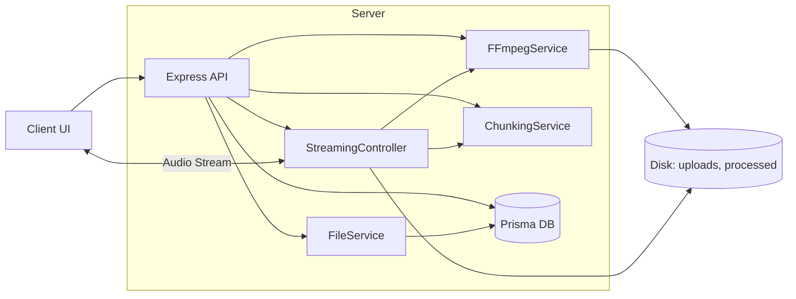
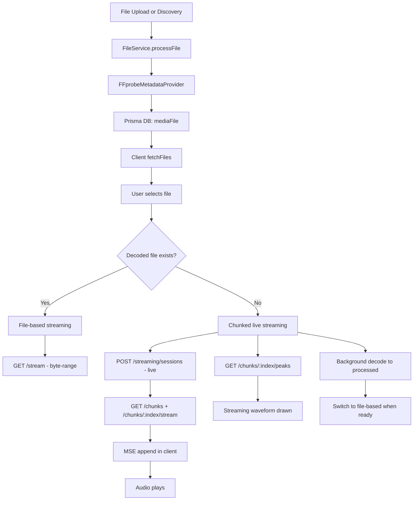

# Current Implementation Overview (Updated)

This document summarizes the end-to-end decoding and streaming flow, including database interactions, chunked streaming, and where each module fits. It is written for a project status briefing.

## At A Glance
- **File-based playback (stable waveform)**  
  Uses HTTP byte-range streaming from decoded files (`processed/`).
- **Chunked live streaming (play-now)**  
  Uses server-side chunk streaming + client-side MSE append, with **server-generated peaks** for real waveform during live chunk playback.
- **Decoding**  
  Raw codec files (G711/G726/G728) are decoded by ffmpeg into WAV/MP3.
- **Database**  
  Media metadata is stored in Prisma DB and used by the UI and streaming services.

## System Architecture

## End-to-End Data Flow

## Streaming Modes

### 1) File-Based Streaming (Default)
**Used when:** decoded file exists in `processed/`.  
**How it works:**
1. Client creates a session with `mode: "file-based"`.
2. Server streams file using HTTP byte ranges.
3. Browser controls range sizes, seeks are instant.
4. WaveSurfer loads the file URL and renders waveform.

### 2) Chunked Live Streaming (Play-Now)
**Used when:** decoded file does not exist.  
**How it works:**
1. Client creates a session with `mode: "live"`.
2. Client fetches chunk metadata.
3. Each chunk is streamed by ffmpeg (`/chunks/:index/stream`).
4. Client appends chunks to a single MSE buffer.
5. Server provides waveform peaks per chunk (`/chunks/:index/peaks`) so waveform is visible during live streaming.
6. Background decode runs; once completed, client switches to file-based streaming seamlessly.

## Database Interaction (Prisma)

**Tables:**
- `mediaFile` stores:
  - `originalPath`, `decodedPath`
  - `duration`, `codec`, `format`, `bitrate`
  - `fileSize`, `status`

**Usage:**
- File discovery and metadata extraction populate `mediaFile`.
- UI uses these values for filtering, duration display, and codec selection.
- Decoding updates `decodedPath` when completed.

## Key Endpoints

**Files**
- `GET /api/files` - list files from DB
- `POST /api/files/upload` - upload and register file

**Decoding**
- `POST /api/ffmpeg/decode` - decode raw codecs to WAV/MP3

**Streaming**
- `POST /api/streaming/sessions` - create session
- `GET /api/streaming/sessions/:id/stream` - file-based stream
- `GET /api/streaming/sessions/:id/chunks` - chunk list
- `GET /api/streaming/sessions/:id/chunks/:index/stream` - chunk stream
- `GET /api/streaming/sessions/:id/chunks/:index/peaks` - waveform peaks

## Component Responsibilities (Selected Files)

**Client**
- `client/src/hooks/useAppController.ts`  
  Orchestrates file state + playback state for the whole UI.
- `client/src/hooks/usePlaybackState.ts`  
  Controls decode/streaming mode, waveform, and transport controls.
- `client/src/hooks/playback/useDecodeAndPlay.ts`  
  Switches between file-based and chunked live streaming, triggers decoding.
- `client/src/components/Player/WaveformPanel.tsx`  
  Renders file-based WaveSurfer or streaming waveform.
- `client/src/components/Player/StreamingWaveform.tsx`  
  Draws server-generated peaks for live chunk streaming.

**Server**
- `server/src/services/file/FileService.ts`  
  File discovery, metadata extraction, DB insert/update.
- `server/src/services/chunking/ChunkingService.ts`  
  Generates time-based chunk metadata.
- `server/src/controllers/StreamingController.ts`  
  Streams chunks, file-based audio, and serves chunk peaks.
- `server/src/services/ffmpeg/FFmpegService.ts`  
  Runs decode/encode/transcode operations.

## How the Project Meets Requirements
- **Supports G711/G726/G728** via FFmpeg decode options.
- **Streaming available**: file-based and live chunked.
- **Waveform available in all modes**:
  - File-based: WaveSurfer on decoded file
  - Live: server-generated peaks
- **Large file support**:  
  Instant playback with chunked streaming, then smooth switch to file-based once decode completes.

## Current Status
- Phase 1 complete (file-based streaming + decoding).
- Phase 2 implemented:
  - Chunked live streaming with MSE
  - Server-generated waveform peaks for live stream
  - Seamless switch to decoded file
