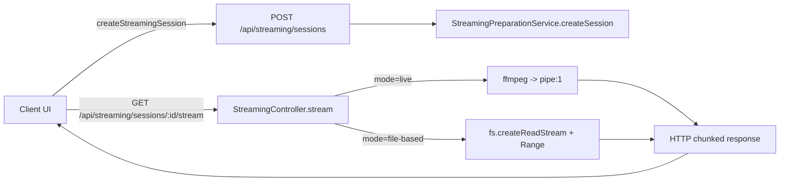

# Current Implementation Overview

## At A Glance
- **Client streaming uses:**
  - Live streaming: `ffmpeg` piping to HTTP response (`Transfer-Encoding: chunked`)
  - File-based streaming: HTTP **byte-range** reads from a file

## High-Level Flow

## Live Streaming (ffmpeg)

**Used when**:
- The client creates a session with `mode: "live"`.

**What happens**:
1. Client calls `POST /api/streaming/sessions` with options including input codec, sample rate, bitrate, and output format.
2. Client calls `GET /api/streaming/sessions/:id/stream`.
3. Server spawns `ffmpeg` and pipes `stdout` directly to the HTTP response.

**Key properties**:
- Response is `Transfer-Encoding: chunked`.
- Chunk size is **not fixed** by the app.
  - It depends on ffmpeg output buffering + Node stream buffering.

## File-Based Streaming (Byte-Range)

**Used when**:
- The client creates a session with `mode: "file-based"`.

**What happens**:
1. Client requests `GET /api/streaming/sessions/:id/stream`.
2. Server reads the file directly from disk.
3. If `Range` header exists, server sends that byte range.

**Key properties**:
- `Accept-Ranges: bytes` is enabled.
- The **browser/player decides the range size**.

## Chunking Service (Currently Not Used by Client)

There is a backend chunking pipeline:
- `StreamingPreparationService.prepareChunks`
- `StreamingPreparationService.handlePlaybackControl`
- `ChunkingService` splits files into time-based chunks

Right now, the client does **not** call these endpoints during playback.
